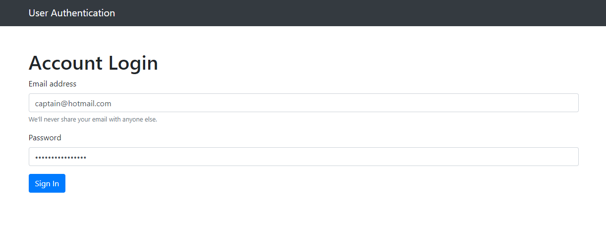
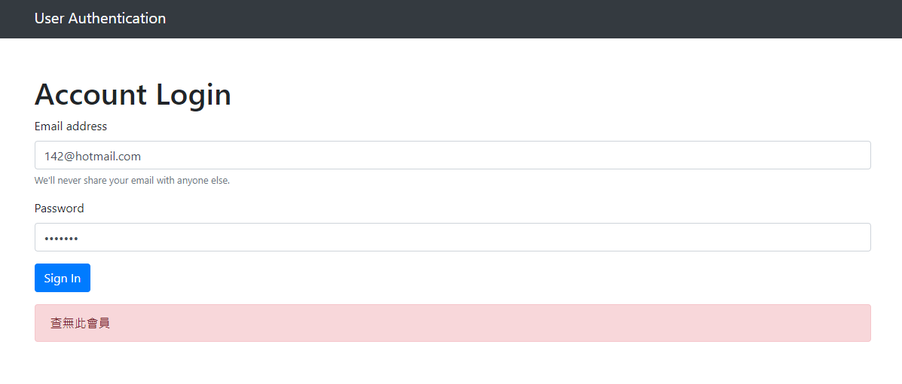
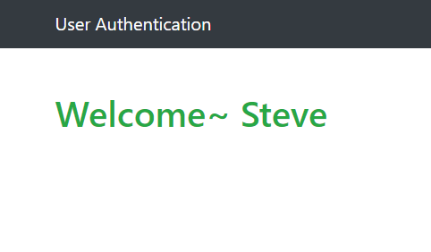

# User Authentication

AlphaCamp Project : user-authentication

## 網站主要功能

- 使用者可以輸入已存在的帳號密碼進行登入

## 專案畫面演示





## 預設帳號組

- email: tony@stark.com password: iamironman
- email: captain@hotmail.com password: icandothisallday
- email: peter@parker.com password: enajyram
- email: natasha@gamil.com password: \*parol#@$!
- email: nick@shield.com password: password

## 環境建置

- [Visual Studio Code](https://code.visualstudio.com/)
- [Node Version Manager (nvm) for Windows](https://github.com/coreybutler/nvm-windows/releases)
- 使用 nvm 安裝 Node.js v14.17.1
- [nodemon](https://www.npmjs.com/package/nodemon)
- [Express](https://www.npmjs.com/package/express)
- [Express Handlebars](https://www.npmjs.com/package/express-handlebars)
- [MongoDB](https://www.mongodb.com/try/download/community)
- [mongoose](https://www.npmjs.com/package/mongoose)

## 安裝專案

### 1. 開啟終端機(Terminal)，Clone 此專案至本機

```
git clone https://github.com/YPINPIN/user-authentication.git
```

### 2. Terminal 輸入以下指令進入專案

```
cd user-authentication
```

### 3. Terminal 輸入以下指令安裝 npm 套件

```
npm install
```

### 4. 加入種子資料

```
npm run seed
```

### 4. Terminal 輸入以下指令啟動伺服器

```
npm run start
```

Terminal 顯示 Server is running on http://localhost:3000 即啟動完成

### 5. 請至 http://localhost:3000 開始使用網站

## 專案開發人員

> [YPINPIN](https://github.com/YPINPIN)
